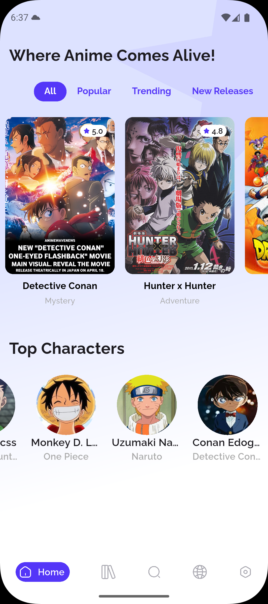
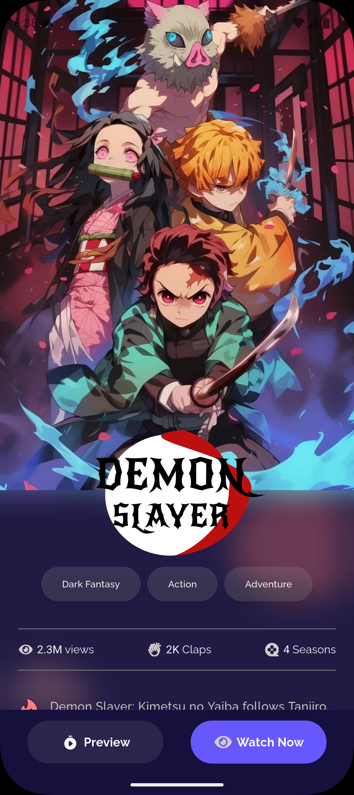
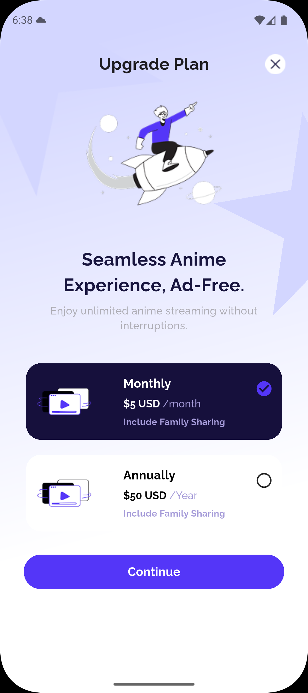

# My Anime Data 📺✨

A modern Flutter application showcasing various UI components and widgets for an anime streaming platform. This project was created as a Flutter widget training exercise, demonstrating custom UI designs, animations, and responsive layouts.

## 🎯 Project Overview

**My Anime Data** is a beautifully designed anime streaming app UI that demonstrates advanced Flutter widget implementation. The app features a clean, modern interface with custom components, gradient backgrounds, and interactive elements.

### Key Learning Focus

- Custom Flutter Widget Development
- Advanced UI/UX Implementation
- State Management with StatefulWidget
- Navigation and Routing
- Custom Theming and Styling
- Responsive Design Patterns

## 🚀 Features

### 🏠 Home Screen

- **Gradient Background**: Custom linear gradient implementation
- **Tab Navigation**: Scrollable tab bar with custom styling
- **Anime Cards**: Interactive show cards with ratings and genres
- **Character Showcase**: Horizontal scrolling character gallery
- **Custom Bottom Navigation**: Stateful navigation bar with active/inactive states

### 📱 Details Screen

- **Hero Animations**: Smooth transitions between screens
- **Blur Effects**: Custom backdrop filter implementation
- **Analytics Display**: Custom widgets for showing views, claps, and seasons
- **Genre Tags**: Dynamic genre button widgets
- **Custom App Bar**: Floating action buttons with glassmorphism effect

### 💎 Upgrade Plan Screen

- **Interactive Cards**: Selectable plan cards with state management
- **Animated Backgrounds**: Positioned decorative elements
- **Custom Buttons**: Styled continue and cancel buttons
- **Responsive Layout**: Adaptive design for different screen sizes

## 🛠️ Technical Implementation

### Widget Structure

```
lib/
├── main.dart                     # App entry point
├── anime_data_app.dart          # Root app widget
├── core/
│   ├── theming/
│   │   ├── colors.dart          # Color management system
│   │   └── text_styles.dart     # Typography system
│   └── widgets/
│       ├── show_card.dart       # Reusable anime show cards
│       ├── character_card.dart  # Character display widgets
│       ├── analytics_item.dart  # Analytics display components
│       └── genra_button.dart    # Genre tag buttons
└── features/
    ├── home/
    │   └── ui/
    │       ├── home_screen.dart
    │       └── widgets/
    │           ├── nav_bar.dart
    │           ├── nav_bar_item.dart
    │           ├── nav_bar_active_item.dart
    │           ├── nav_bar_inactive_item.dart
    │           └── tab_bar_widget.dart
    ├── details/
    │   └── ui/
    │       ├── details_screen.dart
    │       └── widgets/
    │           ├── analytics_widget.dart
    │           └── custom_bottom_app_bar.dart
    └── upgrade_plan/
        └── ui/
            ├── upgrade_plane_screen.dart
            └── widgets/
                └── plan_card.dart
```

### Custom Components Demonstrated

#### 🎨 Theming System

- **ColorManager**: Centralized color scheme management
- **TextStyles**: Comprehensive typography system using Raleway font
- **Custom Gradients**: Multiple gradient implementations

#### 🔧 Reusable Widgets

- **ShowCard**: Interactive cards with image, rating, and navigation
- **PlanCard**: Selectable subscription plan cards with state
- **NavBarItem**: Smart navigation items with active/inactive states
- **AnalyticsItem**: Data display widgets with icons and text

#### 📱 Advanced UI Techniques

- **Stack Positioning**: Complex layouts with positioned elements
- **Blur Effects**: Backdrop filters for glassmorphism
- **Custom Shapes**: Rounded rectangles and custom borders
- **Gesture Detection**: Tap handlers and navigation

## 📸 Screenshots

### Home Screen



_Showcases gradient backgrounds, custom tab bars, anime cards, and bottom navigation_

### Details Screen



_Features blur effects, analytics widgets, genre tags, and custom app bars_

### Upgrade Plan Screen



_Demonstrates interactive plan cards, positioned decorations, and form layouts_

## 🏗️ Getting Started

### Prerequisites

- Flutter SDK (^3.9.0)
- Dart SDK
- Android Studio / VS Code
- iOS Simulator / Android Emulator

### Installation

1. **Clone the repository**

   ```bash
   git clone <repository-url>
   cd my_anime_data
   ```

2. **Install dependencies**

   ```bash
   flutter pub get
   ```

3. **Run the application**
   ```bash
   flutter run
   ```

### Dependencies

```yaml
dependencies:
  flutter:
    sdk: flutter
  flutter_svg: ^2.0.10+1 # SVG asset support

dev_dependencies:
  flutter_test:
    sdk: flutter
  flutter_lints: ^4.0.0 # Linting rules
```

## 🎨 Design System

### Color Palette

- **Primary**: `#5436F8` - Main brand color
- **Secondary**: `#A9A9A9` - Secondary text and elements
- **Dark Purple**: `#16103C` - Dark theme accents
- **Gradients**: Custom linear gradients throughout the app

### Typography

- **Font Family**: Raleway
- **Variants**: Thin, Light, Regular, Medium, SemiBold, Bold, ExtraBold, Black
- **Responsive Sizing**: 11px to 24px with appropriate line heights

### Assets

- **Images**: PNG format for photos and illustrations
- **Icons**: SVG format for scalable vector graphics
- **Fonts**: TTF format for custom typography

## 📚 Learning Outcomes

This project demonstrates proficiency in:

- ✅ **Custom Widget Creation**: Building reusable, parameterized widgets
- ✅ **State Management**: Implementing StatefulWidget and state updates
- ✅ **Navigation**: Route management and screen transitions
- ✅ **Theming**: Creating consistent design systems
- ✅ **Layouts**: Complex UI layouts with Stack, Column, Row, and Positioned
- ✅ **Animations**: Smooth transitions and interactive elements
- ✅ **Asset Management**: Efficient handling of images, fonts, and icons
- ✅ **Responsive Design**: Adaptive layouts for different screen sizes

## 🔄 Widget Training Focus Areas

### 1. **Layout Widgets**

- `Container`, `Stack`, `Column`, `Row`
- `Positioned`, `Expanded`, `Flexible`
- `Padding`, `SizedBox`, `Divider`

### 2. **Input & Interaction**

- `GestureDetector`, `InkWell`
- `FilledButton`, `TabBar`, `TabController`

### 3. **Styling & Theming**

- `BoxDecoration`, `BorderRadius`
- `LinearGradient`, `BoxShadow`
- `TextStyle`, `Theme`

### 4. **Navigation & Structure**

- `Scaffold`, `AppBar`, `BottomNavigationBar`
- `Navigator`, `MaterialPageRoute`
- `DefaultTabController`

### 5. **Advanced Effects**

- `BackdropFilter`, `ImageFilter`
- `ClipRRect`, `Hero`
- `SingleChildScrollView`, `ListView`

## 🤝 Contributing

This is a learning project focused on Flutter widget development. Feel free to:

- Fork the repository
- Create feature branches
- Submit pull requests with new widget implementations
- Share feedback and suggestions

## 📄 License

This project is open source and available under the [MIT License](LICENSE).

## 🙏 Acknowledgments

- **Flutter Team** - for the amazing framework
- **Design Inspiration** - Modern anime streaming platforms
- **Assets** - Custom illustrations and icons used for educational purposes

---

**Built with ❤️ using Flutter** | **Widget Training Project** | **2024**
